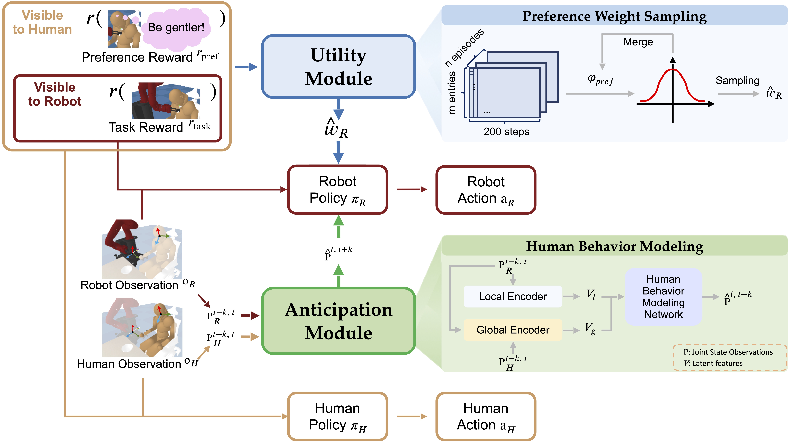

# Learning Human-aware Robot Policies for Adaptive Assistance

<p align="center">
  <a href="https://arxiv.org/abs/2412.11913" target="_blank">
    </a>
  <a href="https://asonin.github.io/Human-Aware-Assistance/" target="_blank">
    </a>
  <a href="https://youtu.be/yNTk-Wt6feA" target="_blank">
    </a>
</p>

This repository provides the official PyTorch implementation for the paper **"Learning Human-aware Robot Policies for Adaptive Assistance"**.


## Overview

This project focuses on developing adaptive robot assistance policies that are aware of human preferences and behaviors. It incorporates various modules to enhance robot interaction and assistance capabilities. The following sections will guide you through setting up the environment, training the model, and evaluating performance.

## Installation

### Prerequisites
1. Visit [Assistive Gym Subfolder](https://github.com/Healthcare-Robotics/assistive-gym/tree/main/assistive_gym/envs) to download folder ```assets```, then put it under ```assistive_gym/envs```.

2. Follow the instructions in the [Assistive Gym README](https://github.com/Healthcare-Robotics/assistive-gym/blob/main/README.md) to install the **Assistive Gym** environment. **Note**: This repository contains modified versions of the original Assistive Gym, so please use our customized implementation for best results.
3. Install required dependencies by running the following command:

   ```bash
   conda create --name <env> --file requirements.txt
   ```

### Environment Setup

To further modify the Assistive Gym environment, navigate to `assistive_gym/envs`.

## Training the Model



To train the model, execute the following command:

```bash
sh train.sh
```

### Configurable Parameters

You can adjust the following arguments based on your requirements:

- **Environment**: `--env FeedingSawyerHuman-v1`
- **Preference Setting**: `--setting-name 1`
- **Anticipation Module**: `--social` (Enable or disable anticipation module)
- **Dynamic Future Mechanism**: `--dynamic-future` (Enable or disable future predictions)
- **Utility Module**: `--dempref --continuous-sampling` (Enable the utility module and continuous sampling)
- **Merging Parameter**: `--merge-alpha 0.5`
- **Reinforcement Learning Algorithm**: `--exp-name PPO` (or other RL algorithms)

## Evaluation

To evaluate the trained model, modify the `train.sh` script with the following arguments:

- **Load Path**: `--load-policy-path <path_to_checkpoint>` (Path to your trained model)
- **Epoch**: `--epoch <epoch_number>` (Specify the epoch number for evaluation)

This will perform evaluation without further training.

### Example Evaluation Visuals

<p align="center">
  
  <br>
</p>

<p align="center">
  
  <br>
</p>

## Citation

If you find this work useful, please cite the following paper:

```
@misc{qin2024learninghumanawarerobotpolicies,
      title={Learning Human-Aware Robot Policies for Adaptive Assistance}, 
      author={Jason Qin and Shikun Ban and Wentao Zhu and Yizhou Wang and Dimitris Samaras},
      year={2024},
      eprint={2412.11913},
      archivePrefix={arXiv},
      primaryClass={cs.RO},
      url={https://arxiv.org/abs/2412.11913}, 
}
```

## Acknowledgements

- The base RL algorithms are built on top of [Spinning Up](https://github.com/openai/spinningup).
- The anticipation module is based on [Social-CH](https://github.com/Walter0807/Social-CH).
- The utility module is based on [Dempref](https://github.com/malayandi/DemPrefCode).

We thank the authors of these projects for releasing their source code.
